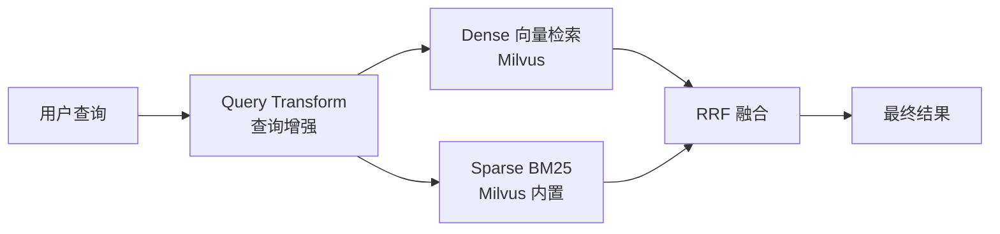

# Buddy-AI 智能问答助手

基于 LangGraph 的中文智能问答系统，支持混合检索（向量+BM25）、Plan-and-Execute 任务规划、Reflection 自我改进、网络搜索和长期记忆功能。


## LangGraph 工作流程


#### 节点说明

| 节点 | 文件 | 功能 |
|------|------|------|
| `retrieve_memories` | `nodes/memory.py` | 从 Mem0 检索用户长期记忆 |
| `router` | `nodes/router.py` | LLM 判断查询类型，路由到 knowledge_base_search / plan_and_execute / direct_answer |
| `query_transform` | `nodes/retriever.py` | 查询增强与改写 |
| `hybrid_search` | `nodes/retriever.py` | Milvus 向量+BM25 混合检索 |
| `text_match` | `nodes/retriever.py` | 文本匹配检索 |
| `generate_response` | `nodes/generate_response.py` | ReAct 模式响应生成，支持工具调用 |
| `planner` | `nodes/planner.py` | 复杂任务拆解为执行步骤 |
| `work_step` | `nodes/planner.py` | 执行计划中的单个步骤 |
| `synthesis_step_results` | `nodes/planner.py` | 汇总步骤执行结果 |
| `evaluate_node` | `nodes/evaluator.py` | Reflection 评估，最多 3 次迭代优化 |
| `tool_node` | LangGraph 内置 | 执行工具调用（tavily_search / wikipedia） |

#### GraphState 状态

```python
class GraphState(MessagesState):
    memory_context: str | None           # Mem0 记忆上下文
    route_decision: str                  # 路由决策 (answer_directly / knowledge_base_search / plan_and_execute)
    original_input: str                  # 用户原始输入
    enhanced_input: list[str] | None     # 增强后的查询
    rag_docs: list[dict]                 # 检索到的文档
    plan: PlanState | None               # 任务执行计划
    reflection_count: int                # 反思次数（最多 3 次）
    reflection: ReflectionState | None   # 反思评估结果
    draft_answer: str | None             # 草稿答案
    final_answer: str | None             # 最终答案
```

## 项目架构

- **后端**: FastAPI + LangGraph（根目录 `main.py` + `apps/`）
- **前端**: Vue 3 + Vite + TypeScript + Pinia + Element Plus（`frontend/`）
- **LLM**: OpenAI / 阿里云 DashScope (Qwen) / 智谱 AI，可配置切换
- **向量库**: Milvus（混合检索：Dense + Sparse BM25 + RRF 融合）
- **记忆**: Mem0 + Milvus 向量存储
- **会话**: Redis Checkpointing（LangGraph 原生支持）
- **包管理**: uv (pyproject.toml)

## 核心特性

- 🤖 **智能路由**: LLM 自动判断查询类型，动态选择执行路径
- 📚 **混合检索**: Milvus Dense 向量 + Sparse BM25 + RRF 融合
- 🔍 **网络搜索**: Tavily API + Wikipedia 实时搜索
- 💾 **长期记忆**: Mem0 自动保存用户偏好和历史记录
- 📋 **任务规划**: Plan-and-Execute 模式处理复杂多步骤任务
- 🔄 **自我改进**: Reflection 机制评估答案质量，最多 3 次迭代优化
- 💬 **流式输出**: SSE 实时推送 Agent 增量 token
- 🎨 **现代化 UI**: ChatGPT 风格界面，支持暗黑主题切换

## 技术亮点

### LangGraph 智能体架构

- **三路路由**: LLM 智能判断 → 直接回答 / 知识库检索 / 任务规划执行
- **ReAct 模式**: generate_response 节点支持工具调用（搜索、Wikipedia）
- **Reflection**: evaluate_node 评估答案质量，不通过则带反馈重新生成
- **Plan-and-Execute**: 复杂任务自动拆解为步骤，逐步执行并汇总
- **状态持久化**: Redis Checkpointing 支持多轮对话上下文恢复

### 混合检索架构


```mermaid
graph LR
    Query[用户查询] --> QT[Query Transform<br/>查询增强]
    QT --> Dense[Dense 向量检索<br/>Milvus]
    QT --> Sparse[Sparse BM25<br/>Milvus 内置]
    Dense --> RRF[RRF 融合]
    Sparse --> RRF
    RRF --> Result[最终结果]
```

- **向量检索**: Milvus Dense 检索，使用 OpenAI text-embedding-3-large（1024 维）
- **BM25 检索**: Milvus 内置 Sparse BM25 函数，关键词匹配
- **RRF 融合**: Reciprocal Rank Fusion 算法合并两路结果

### 记忆系统

**双层记忆架构：**

1. **短期记忆**: Redis Checkpointing
   - LangGraph 原生支持，保存对话状态和执行历史
   - 通过 thread_id 恢复会话

2. **长期记忆**: Mem0 + Milvus
   - 自动保存用户偏好、历史对话、重要约定
   - 基于向量化检索相关记忆
   - retrieve_memories 节点在每次对话开始时自动检索

### SSE 流式通信

**接口**: `POST /agent/chat`

**请求体**:
```json
{
  "user_id": "用户ID",
  "thread_id": "会话ID",
  "user_input": "用户消息"
}
```

**响应**: SSE 流式事件

| 事件 | 说明 |
|------|------|
| `workflow_node` | 增量 token（content 字段为文本片段，node 字段为当前节点名） |
| `final_answer` | 最终完整答案 |
| `error` | 错误信息 |

## 快速开始

### 环境要求

- Python 3.12+
- Node.js 18+
- Redis（会话状态持久化）
- Milvus（向量存储）
- API Key（OpenAI / DashScope / 智谱 AI，至少一个）
- Tavily API Key（可选，网络搜索）

### 安装

1. 克隆项目
```bash
git clone https://github.com/your-repo/buddy-ai.git
cd buddy-ai
```

2. 安装后端依赖
```bash
uv sync
```

3. 安装前端依赖
```bash
cd frontend
npm install
```

### 配置

编辑项目根目录 `.env` 文件：

```env
# LLM 配置（选择一个 provider）
LLM_PROVIDER=openai

# API Keys
DASHSCOPE_API_KEY=your_key
OPENAI_API_KEY=your_key
TAVILY_API_KEY=your_key

# Redis
REDIS_URL=redis://localhost:6379/0

# Milvus
MILVUS_URL=http://localhost:19530
MILVUS_TOKEN=
MILVUS_DB_NAME=buddy_ai

# Embedding
EMBEDDING_MODEL=text-embedding-3-large
EMBEDDING_DIMENSIONS=1024
```

### 运行

1. 启动后端
```bash
uvicorn main:app --reload --host 127.0.0.1 --port 8000
```

2. 启动前端
```bash
cd frontend
npm run dev
```

### 访问

- 前端: http://localhost:5173
- 后端 API: http://localhost:8000
- API 文档: http://localhost:8000/docs

## 项目结构

```
buddy-ai/
├── main.py                          # FastAPI 应用入口
├── apps/
│   ├── config.py                    # 配置管理（Pydantic Settings + .env）
│   └── agent/                       # LangGraph Agent 核心
│       ├── graph.py                 # StateGraph 工作流定义（节点、边、条件路由）
│       ├── state.py                 # GraphState 状态定义（路由、检索、计划、反思）
│       ├── condition.py             # 条件路由函数
│       ├── nodes/                   # 工作流节点
│       │   ├── router.py            # 智能路由（answer_directly / knowledge_base_search / plan_and_execute）
│       │   ├── retriever.py         # 检索节点（query_transform / hybrid_search / text_match）
│       │   ├── generate_response.py # ReAct 响应生成（支持工具调用）
│       │   ├── planner.py           # Plan-and-Execute（plan_step / work_step / synthesis）
│       │   ├── evaluator.py         # Reflection 评估节点
│       │   ├── memory.py            # 记忆检索与保存节点
│       │   ├── direct_answer.py     # 直接回答节点
│       │   └── message_summarizer.py # 消息摘要节点
│       ├── llm/
│       │   └── llm_factory.py       # LLM 工厂（OpenAI / DashScope / 智谱 AI）
│       ├── memory/
│       │   └── mem0.py              # Mem0 长期记忆（Milvus 向量存储）
│       ├── rag/
│       │   ├── milvus_vector.py     # Milvus 混合检索（Dense + Sparse BM25 + RRF）
│       │   ├── qwen3_embedding.py   # Embedding 模型
│       │   └── models/              # 文档元数据模型
│       ├── tools/
│       │   └── tools.py             # 工具定义（Tavily 搜索、Wikipedia）
│       ├── prompt/
│       │   └── prompt.py            # 系统提示词模板
│       └── utils/
│           └── message_summarizer.py # 消息摘要工具
├── frontend/                        # Vue 3 前端
│   ├── index.html
│   ├── package.json
│   ├── vite.config.ts               # Vite 配置（/agent 代理到后端）
│   ├── tsconfig.json
│   └── src/
│       ├── main.ts                  # 入口（Vue Router + Pinia + Element Plus）
│       ├── App.vue                  # 根组件（Sidebar + RouterView 布局）
│       ├── router/
│       │   └── index.ts             # 路由（/ 欢迎页、/chat/:threadId 对话页）
│       ├── stores/
│       │   ├── chat.ts              # ChatStore（对话线程、消息、流式状态）
│       │   └── user.ts              # UserStore（userId、主题、localStorage 持久化）
│       ├── services/
│       │   └── sse.ts               # SSE 客户端（fetch + ReadableStream，POST 请求）
│       ├── views/
│       │   ├── WelcomePage.vue      # 欢迎页（居中欢迎语 + 输入框）
│       │   └── ChatPage.vue         # 对话页（ChatWindow + MessageInput + SSE 集成）
│       ├── components/
│       │   ├── Sidebar.vue          # 侧边栏（项目名 + 设置 + 对话列表）
│       │   ├── SidebarSettings.vue  # 设置区域（User ID + 主题切换）
│       │   ├── ThemeSwitcher.vue    # 主题切换滑动按钮
│       │   ├── ChatWindow.vue       # 聊天窗口（消息气泡 + 自动滚动 + 加载指示器）
│       │   └── MessageInput.vue     # 消息输入（+ 按钮上传 + 发送按钮）
│       ├── types/
│       │   └── index.ts             # TypeScript 类型定义
│       └── assets/
│           └── styles/
│               └── main.css         # 全局样式（暗黑主题 + 滚动条）
├── pyproject.toml                   # Python 依赖（uv 管理）
├── docs/                            # 文档与截图
└── ARCHITECTURE.md
```

## 开发指南

### 后端开发

```bash
# 安装依赖
uv sync

# 启动开发服务器
uvicorn main:app --reload --port 8000

# 添加新依赖
uv add package_name
```

### 前端开发

```bash
cd frontend

# 安装依赖
npm install

# 开发模式
npm run dev

# 构建
npm run build
```

**前端技术栈**:
- Vue 3 Composition API + TypeScript
- Pinia 状态管理
- Element Plus UI 组件库（含暗黑主题）
- SSE 流式通信（fetch + ReadableStream）
- Vue Router 4

## 贡献指南

欢迎提交 Issue 和 Pull Request！

## 许可证

MIT License
