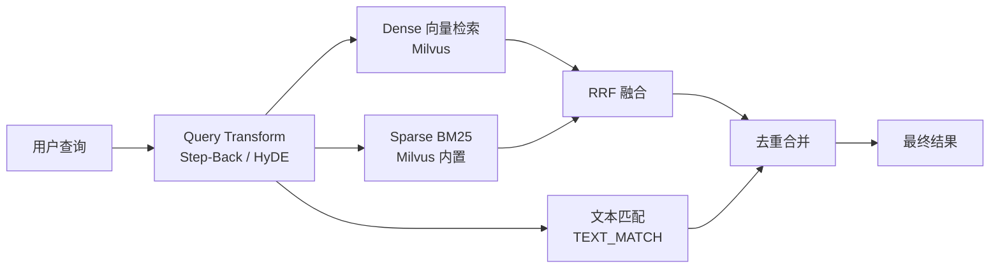

# Buddy-AI 智能问答助手

基于 LangGraph 的中文智能问答系统，支持混合检索（Dense 向量 + Sparse BM25 + RRF 融合）、Plan-and-Execute 任务规划、Reflection 自我改进、网络搜索和双层记忆（短期 Redis + 长期 Mem0）功能。

## LangGraph 工作流程


#### 节点说明

| 节点 | 文件 | 功能 |
|------|------|------|
| `retrieve_memories` | `nodes/memory.py` | 从 Mem0 检索用户长期记忆（相似度阈值 0.7，最多 3 条） |
| `router` | `nodes/router.py` | LLM 结构化输出判断查询类型，路由到 knowledge_base_search / plan_and_execute / answer_directly |
| `query_transform` | `nodes/retriever.py` | 查询增强：Step-Back Prompting（退步提示）或 HyDE（假设性文档嵌入） |
| `hybrid_search` | `nodes/retriever.py` | Milvus Dense 向量 + Sparse BM25 混合检索（RRF 融合） |
| `text_match` | `nodes/retriever.py` | Milvus 文本匹配 + 向量相似性联合检索 |
| `generate_response` | `nodes/generate_response.py` | ReAct 模式响应生成，支持工具调用，含消息摘要压缩 |
| `planner` | `nodes/planner.py` | 复杂任务拆解为执行步骤（LLM 结构化输出） |
| `work_step` | `nodes/planner.py` | 通过 Send() API 并行执行计划中的各步骤 |
| `synthesis_step_results` | `nodes/planner.py` | 汇总所有步骤执行结果为最终答案 |
| `evaluate_node` | `nodes/evaluator.py` | Reflection 评估答案质量，不通过则带反馈重新生成（最多 3 次） |
| `tool_node` | LangGraph ToolNode | 执行工具调用（Tavily Search / Wikipedia） |
| `save_memories` | `nodes/memory.py` | 语义去重后存储本轮对话到 Mem0 长期记忆 |

#### 条件路由

| 路由函数 | 位置 | 逻辑 |
|----------|------|------|
| `route_condition` | `condition.py` | router → query_transform / planner / generate_response（直接回答） |
| `generate_response_router` | `condition.py` | generate_response → tool_node（有工具调用）/ evaluate_node（需评估）/ save_memories（完成） |
| `assign_workers` | `condition.py` | planner → 通过 Send() API 并行分发 work_step |

#### GraphState 状态

```python
class GraphState(MessagesState):
    memory_context: str | None           # Mem0 记忆上下文
    route_decision: str                  # 路由决策 (answer_directly / knowledge_base_search / plan_and_execute)
    route_reason: str | None             # 路由决策理由
    original_input: str                  # 用户原始输入
    enhanced_input: str | None           # 增强后的查询（Query Transform 结果）
    query_transform_type: str | None     # 查询转换类型 (Step_Back_Prompting / HyDE)
    rag_docs: list[dict]                 # 检索到的文档（自动去重合并）
    plan: PlanState | None               # 任务执行计划（含步骤状态和结果）
    reflection_count: int                # 反思次数（最多 3 次）
    reflection: ReflectionState | None   # 反思评估结果（passed + feedback）
    draft_answer: str | None             # 草稿答案
    final_answer: str | None             # 最终答案
```

## 项目架构

- **后端**: FastAPI + LangGraph（`main.py` 入口 + `apps/` 模块）
- **前端**: Vue 3 + Vite + TypeScript + Pinia + Element Plus（`frontend/`）
- **LLM**: OpenAI / 阿里云 DashScope (Qwen)，通过 LLM Factory 统一切换
- **向量库**: Milvus（混合检索：Dense + Sparse BM25 + RRF 融合）
- **Embedding**: OpenAI text-embedding-3-large（1024 维），备选 Qwen3-Embedding 本地模型
- **长期记忆**: Mem0 + Milvus 向量存储（语义去重）
- **短期记忆**: Redis Checkpointing（LangGraph 原生 `RedisSaver`）
- **消息压缩**: LLM 摘要压缩，保留最近 5 条消息，旧消息生成摘要
- **包管理**: uv（`pyproject.toml`）

## 核心特性

- 🤖 **智能路由**: LLM 结构化输出（`with_structured_output`）自动分类查询，三路动态路由
- 📚 **混合检索**: Milvus Dense 向量 + Sparse BM25 + RRF 融合 + 文本匹配，并行执行
- 🔄 **查询增强**: Step-Back Prompting（退步提示）和 HyDE（假设性文档嵌入）两种策略自动选择
- 🔍 **网络搜索**: Tavily Search（Top 5 结果）+ Wikipedia 实时搜索
- 💾 **双层记忆**: 短期 Redis Checkpoint + 长期 Mem0 向量记忆（语义去重，阈值 0.95）
- 📋 **任务规划**: Plan-and-Execute 模式，Send() API 并行执行步骤
- 🔁 **自我改进**: Reflection 机制评估答案质量，最多 3 次迭代优化
- 💬 **流式输出**: SSE 实时推送 Agent 增量 token（fetch + ReadableStream）
- 📝 **消息压缩**: 超过 5 条消息自动 LLM 摘要压缩，安全切割避免拆分工具调用
- 📄 **文档上传**: 支持 txt / docx / md 文件上传，智能分割入库
- 🎨 **现代化 UI**: ChatGPT 风格界面，Element Plus 暗黑主题切换，Markdown 渲染

## 技术亮点

### LangGraph 智能体架构

- **三路路由**: LLM `with_structured_output` → 直接回答 / 知识库检索 / 任务规划执行
- **ReAct 模式**: `generate_response` 节点通过 `bind_tools` 支持工具调用（搜索、Wikipedia）
- **Reflection**: `evaluate_node` 评估答案质量，不通过则带 feedback 重新生成，最多 3 次
- **Plan-and-Execute**: 复杂任务 LLM 结构化拆解，`Send()` API 并行执行步骤并汇总
- **状态持久化**: `RedisSaver` 支持多轮对话上下文恢复（通过 `thread_id`）
- **消息摘要**: `RemoveMessage` + `SystemMessage` 实现对话历史压缩，安全切割保护工具调用链

### 混合检索架构


```mermaid
graph LR
    Query[用户查询] --> QT[Query Transform<br/>Step-Back / HyDE]
    QT --> Dense[Dense 向量检索<br/>Milvus]
    QT --> Sparse[Sparse BM25<br/>Milvus 内置]
    QT --> TM[文本匹配<br/>TEXT_MATCH]
    Dense --> RRF[RRF 融合]
    Sparse --> RRF
    RRF --> Merge[去重合并]
    TM --> Merge
    Merge --> Result[最终结果]
```

- **向量检索**: Milvus Dense 检索，OpenAI text-embedding-3-large（1024 维）
- **BM25 检索**: Milvus 内置 Sparse BM25 函数（`SPARSE_INVERTED_INDEX` + `DAAT_MAXSCORE`）
- **文本匹配**: Milvus `TEXT_MATCH` + 中文 Analyzer + 向量相似性联合检索
- **RRF 融合**: `RRFRanker(100)` 合并 Dense 和 Sparse 两路结果
- **HyDE 增强**: 当查询转换策略为 HyDE 时，额外用假设性文档进行向量检索并合并
- **去重合并**: `merge_rag_docs` 按文档 ID 自动去重

### 文档处理

- **txt / docx**: `RecursiveCharacterTextSplitter`，中文友好分隔符（句号、问号等）
- **Markdown**: `MarkdownHeaderTextSplitter`（按 h1/h2/h3 拆分）+ 二次 `RecursiveCharacterTextSplitter`
- **Embedding**: OpenAI `text-embedding-3-large`（1024 维），备选 `Qwen3-Embedding-8B` 本地模型（last-token 池化）

### 记忆系统

**双层记忆架构：**

1. **短期记忆**: Redis Checkpointing
   - LangGraph `RedisSaver` 原生支持，保存完整对话状态和执行历史
   - 通过 `thread_id` 恢复会话上下文

2. **长期记忆**: Mem0 + Milvus
   - `retrieve_memories`: 每次对话开始时检索相关记忆（阈值 0.7，最多 3 条）
   - `save_memories`: 对话结束后存储，语义去重（阈值 0.95）避免重复
   - 自动保存用户偏好、历史对话、重要约定

3. **消息压缩**: LLM 摘要
   - 超过 5 条消息时自动触发
   - `RemoveMessage` 删除旧消息 + `SystemMessage` 插入摘要
   - 安全切割：不拆分 `AIMessage(tool_calls)` 和 `ToolMessage` 对

### SSE 流式通信

**接口**: `POST /agent/chat`

**请求体**:
```json
{
  "user_id": "用户ID",
  "thread_id": "会话ID",
  "user_input": "用户消息"
}
```

**响应**: SSE 流式事件

| 事件 | 说明 |
|------|------|
| `workflow_node` | 增量 token（`content` 为文本片段，`node` 为当前节点名） |
| `final_answer` | 最终完整答案 |
| `error` | 错误信息 |

**文件上传接口**: `POST /upload_file`（multipart/form-data）

| 参数 | 类型 | 说明 |
|------|------|------|
| `file` | File | 上传文件（.txt / .docx / .md） |
| `user_id` | string | 用户 ID |
| `knowledge_id` | int | 知识库 ID |

## 快速开始

### 环境要求

- Python 3.12+
- Node.js 18+
- Redis（会话状态持久化）
- Milvus 2.5+（向量存储 + BM25 + 文本匹配）
- API Key（OpenAI / DashScope，至少一个）
- Tavily API Key（可选，网络搜索）

### 安装

1. 克隆项目
```bash
git clone https://github.com/your-repo/buddy-ai.git
cd buddy-ai
```

2. 安装后端依赖
```bash
uv sync
```

3. 安装前端依赖
```bash
cd frontend
npm install
```

### 配置

编辑项目根目录 `.env` 文件：

```env
# LLM 配置
LLM_PROVIDER=openai          # openai / dashscope
LLM_MODEL=gpt-5.2

# API Keys
OPENAI_API_KEY=your_key
DASHSCOPE_API_KEY=your_key    # 阿里云 DashScope（可选）
DASHSCOPE_BASE_URL=https://dashscope.aliyuncs.com/compatible-mode/v1
TAVILY_API_KEY=your_key       # 网络搜索（可选）

# Redis
REDIS_URL=redis://localhost:6379/0

# Milvus
MILVUS_URL=http://localhost:19530
MILVUS_TOKEN=
MILVUS_DB_NAME=buddy_ai
MILVUS_MEM0_COLLECTION_NAME=mem0

# Embedding
EMBEDDING_PROVIDER=openai     # openai / huggingface
EMBEDDING_MODEL=text-embedding-3-large
EMBEDDING_DIMENSIONS=1024

# LangSmith（可选，调试追踪）
LANGSMITH_TRACING=true
LANGSMITH_API_KEY=your_key
LANGSMITH_PROJECT=buddy-ai
```

### 运行

1. 启动后端
```bash
uvicorn main:app --reload --host 127.0.0.1 --port 8000
```

2. 启动前端
```bash
cd frontend
npm run dev
```

### 访问

- 前端: http://localhost:5173
- 后端 API: http://localhost:8000
- API 文档: http://localhost:8000/docs

## 项目结构

```
buddy-ai/
├── main.py                          # FastAPI 入口（/agent/chat SSE + /upload_file 文件上传）
├── apps/
│   ├── config.py                    # Pydantic Settings 配置管理（.env 加载）
│   └── agent/
│       ├── graph.py                 # StateGraph 工作流（节点、边、条件路由、RedisSaver）
│       ├── state.py                 # GraphState + Schema 定义（路由/查询转换/计划/反思）
│       ├── condition.py             # 条件路由函数（route_condition / generate_response_router / assign_workers）
│       ├── workflow_diagram.py      # LangGraph 流程图 PNG 生成工具
│       ├── nodes/
│       │   ├── router.py            # 智能路由（LLM 结构化输出 → 三路分类）
│       │   ├── retriever.py         # 检索节点（query_transform / hybrid_search / text_match）
│       │   ├── generate_response.py # ReAct 响应生成（bind_tools + 消息摘要压缩）
│       │   ├── planner.py           # Plan-and-Execute（plan_step / work_step / synthesis）
│       │   ├── evaluator.py         # Reflection 评估节点（LLM 结构化输出）
│       │   ├── memory.py            # 记忆检索（retrieve_memories）与存储（save_memories）
│       │   └── message_summarizer.py # 消息摘要节点（已弃用，功能移至 utils）
│       ├── llm/
│       │   └── llm_factory.py       # LLM 工厂（OpenAI / DashScope，统一 ChatOpenAI 接口）
│       ├── memory/
│       │   └── mem0.py              # Mem0 长期记忆单例（Milvus 向量存储）
│       ├── rag/
│       │   ├── milvus_vector.py     # Milvus 客户端（Collection 初始化 / Dense+BM25 混合检索 / 文本匹配）
│       │   ├── document_split.py    # 文档分割（txt/docx → Recursive / md → Header + Recursive）
│       │   ├── qwen3_embedding.py   # Qwen3-Embedding 本地模型（last-token 池化，备选方案）
│       │   └── models/              # 文档元数据模型
│       ├── tools/
│       │   └── tools.py             # 工具定义（Tavily Search + Wikipedia）
│       ├── prompt/
│       │   └── prompt.py            # 系统提示词模板（预留）
│       └── utils/
│           ├── message_summarizer.py # 消息摘要压缩（RemoveMessage + SystemMessage 回写 state）
│           └── id_util.py           # Snowflake ID 生成器
├── frontend/                        # Vue 3 前端
│   ├── index.html
│   ├── package.json                 # 依赖：vue3 / pinia / element-plus / markdown-it / nanoid
│   ├── vite.config.ts               # Vite 配置（/agent + /upload_file 代理到后端 8000）
│   └── src/
│       ├── main.ts                  # 入口（Vue Router + Pinia + Element Plus + 暗黑主题）
│       ├── App.vue                  # 根组件（Sidebar + RouterView 布局）
│       ├── router/index.ts          # 路由（/ 欢迎页、/chat/:threadId 对话页）
│       ├── stores/
│       │   ├── chat.ts              # ChatStore（线程管理 / 消息追加 / 流式状态 / localStorage 持久化）
│       │   └── user.ts              # UserStore（userId / 主题 / localStorage 持久化）
│       ├── services/
│       │   ├── sse.ts               # SSE 客户端（fetch + ReadableStream，POST 请求，标准 SSE 解析）
│       │   └── api.ts               # 文件上传 API（扩展名校验 + FormData）
│       ├── views/
│       │   ├── WelcomePage.vue      # 欢迎页（居中标题 + 输入框，发送后自动创建线程跳转）
│       │   └── ChatPage.vue         # 对话页（ChatWindow + ChatInput + SSE 集成 + autoSend）
│       ├── components/
│       │   ├── Sidebar.vue          # 侧边栏（项目名 + 设置 + 新建对话 + 对话列表 + 删除）
│       │   ├── SidebarSettings.vue  # 设置区域（User ID 输入 + 主题切换）
│       │   ├── ThemeSwitcher.vue    # 主题切换（el-switch 🌙/☀️）
│       │   ├── ChatWindow.vue       # 聊天窗口（消息气泡 + Markdown 渲染 + 自动滚动 + 打字指示器）
│       │   └── ChatInput.vue        # 消息输入（textarea 自适应 + 文件上传 + Enter 发送 + Shift+Enter 换行）
│       ├── types/index.ts           # TypeScript 类型定义（Message / Thread / SSEJsonLine）
│       └── assets/styles/main.css   # 全局样式（暗黑主题 / 滚动条 / 布局）
├── docs/                            # 文档
│   └── langgraph_workflow.png       # LangGraph 工作流程图
├── pyproject.toml                   # Python 依赖（uv 管理）
└── .env                             # 环境变量配置
```

## 开发指南

### 后端开发

```bash
# 安装依赖
uv sync

# 启动开发服务器
uvicorn main:app --reload --port 8000

# 添加新依赖
uv add package_name

# 生成 LangGraph 工作流程图
python -m apps.agent.workflow_diagram
```

### 前端开发

```bash
cd frontend

# 安装依赖
npm install

# 开发模式
npm run dev

# 类型检查 + 构建
npm run build
```

**前端技术栈**:
- Vue 3 Composition API + TypeScript
- Pinia 状态管理（localStorage 持久化）
- Element Plus UI 组件库（含暗黑主题）
- markdown-it Markdown 渲染
- SSE 流式通信（fetch + ReadableStream，支持标准 SSE 格式解析）
- Vue Router 4（欢迎页 + 对话页）

### LLM Provider 切换

在 `.env` 中修改 `LLM_PROVIDER`：

| Provider | 配置值 | 所需 Key |
|----------|--------|----------|
| OpenAI | `openai` | `OPENAI_API_KEY` |
| 阿里云 DashScope | `dashscope` | `DASHSCOPE_API_KEY` |

LLM Factory 统一使用 `ChatOpenAI` 接口，DashScope 通过兼容模式接入。

## 许可证

MIT License
